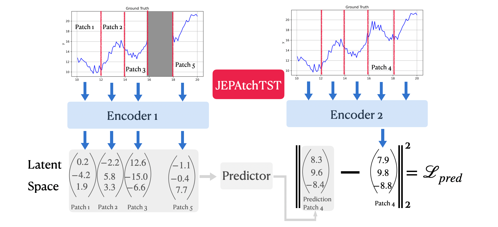

# JEPAtchTST: Time Series Self-Representation Learning Using Patch-Based Transformers and Joint Embedding Predictive Architecture

This repository contains the implementation of **JEPAtchTST**, a Transformer-based encoder that leverages JEPA's pretraining for Time Series Self-Representation Learning.

---

## Encoder's pretraining Overview 🧠



## 🚀 Getting Started


### 1. Install Dependencies

```bash
pip install -r requirements.txt
```

### 2. Pretrained Encoder

```bash
cd pretraining  
```

```bash
python pretraining.py
```
The encoder is pretrained on the [UTS-1G](https://www.cs.ucr.edu/~eamonn/time_series_data_2018/) dataset. The pretrained encoder is saved in `checkpoint/jepatchtst.ckpt`. We provide a pretrained encoder in the `checkpoint` folder. It is also possible to load the pretrained encoder from the Hugging Face Hub setting the `load_hub` argument to `True` in the `conf/encoder/config_encoder.yaml` file.


### 3. Anomaly Detection

```bash
cd anomaly_detection  
```

#### a. Prepare the Datasets
To install the datasets, you can use the following command:
```bash
python dataset/preprocess.py
```
For the **SWaT** dataset, you need to claim the data from the [iTrust website](https://itrust.sutd.edu.sg/itrust-labs_datasets/dataset_info/) and place it in the `data/swat` directory. Files needed: SWaT_Dataset_Normal_v1.xlsx, SWaT_Dataset_Attack_v0.xlsx


#### b. Run the Anomaly Detection on all datasets

```bash
chmod +x ./run_models.sh
./run_models.sh
```


### 4. Forecasting

```bash
cd forecasting  
```

#### a. Prepare the Datasets
To install the datasets, you can use the following command:
```bash
python preprocess.py
```

#### b. Run the Forecasting on all datasets

```bash
chmod +x ./run_models.sh
./run_models.sh
```

### 5. Classification

```bash
cd classification  
```

#### a. Artificial Datasets
```bash
cd type1/
python main.py
```

#### b. Real Datasets
```bash
cd type2/
python main.py
```

### 6. Latent Space Visualization

```bash
cd embedding_visualization  
```
Open the notebook `latent_space.ipynb` to visualize the latent space of the pretrained encoder for various signals.

### 7. Results

Complete results for the anomaly detection, forecasting, and classification tasks can be found in the `results.ipynb` notebook. This notebook provides a comprehensive overview of the performance of JEPAtchTST across different datasets and tasks.

### 8. GitHub Repositoru acknowledgment
This project is inspired by the following GitHub repositories:
- [I-JEPA](https://github.com/facebookresearch/ijepa)
- [JEPA](https://github.com/facebookresearch/vicreg)
- [PatchTST](https://github.com/yuqinie98/PatchTST)
- [MOMENT](https://github.com/moment-timeseries-foundation-model/moment)

## 📚 Citation

If you use this project in your research, please cite:

```
@misc{
      title={JEPAtchTST}, 
      author={Samy-Melwan Vilhes and Gilles Gasso and Mokhtar Z Alaya},
      year={2025},
}
```